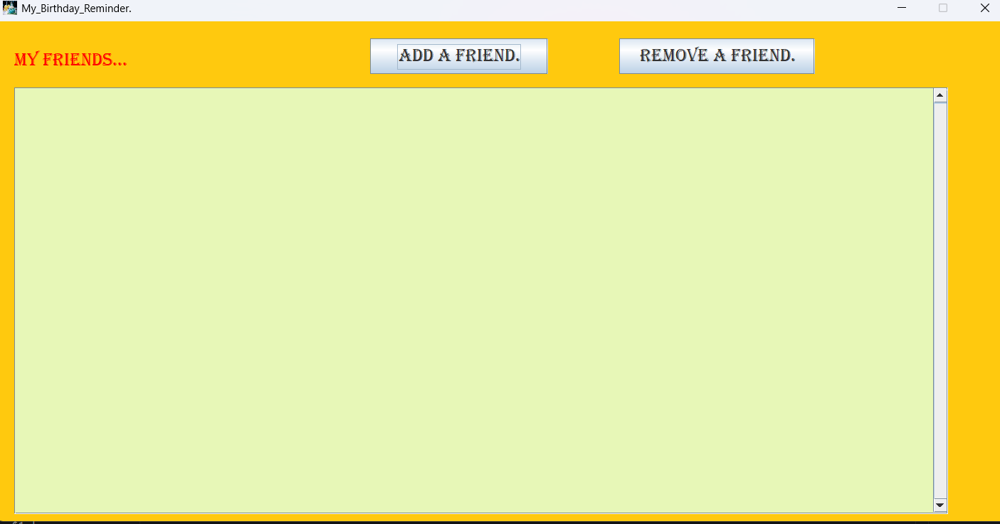
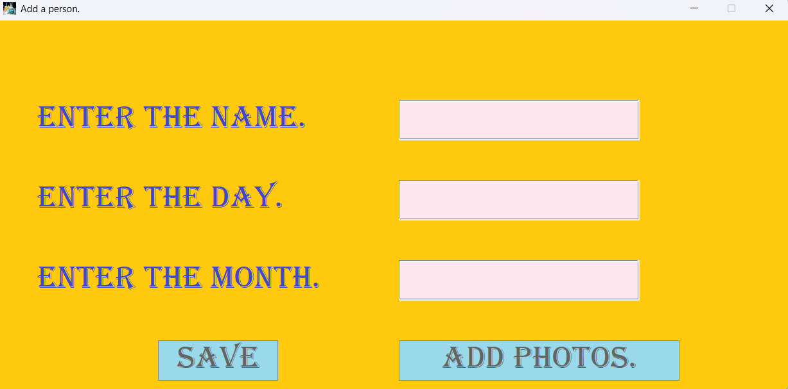

# Birthday Reminder

## Overview

I wanted a simple way to remember the birthdays of my close friends and family members, so I created this Birthday Reminder application for personal use. The application automatically notifies me of upcoming birthdays.

The original source code has mostly been lost due to hard disk corruption, but I was able to recover and decompile the executable saved in cloud, which is preserved in this repository.

## Learning Outcomes

### Windows Startup Process

* Explored how applications can be configured to launch automatically when Windows starts.
* Learned about startup folders and the Windows boot process.
* Understood how background applications can run without requiring manual intervention.

## Features

* Store birthdays of friends and family.
* Automatic birthday notifications.
* Runs automatically when the system starts.
* Simple and easy-to-use interface.

## Screenshots

### Main Application Interface

### Adding Friend

## Conclusion

This project helped me understand Windows startup mechanisms, date-based automation, and the development of productivity-focused desktop applications while solving a practical personal need.
